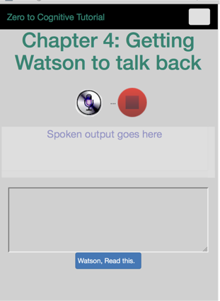
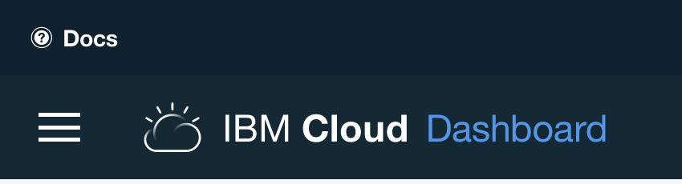
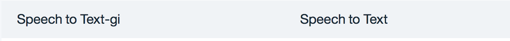
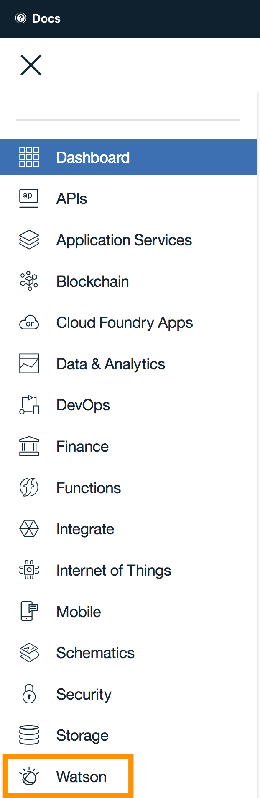
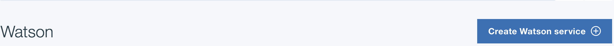
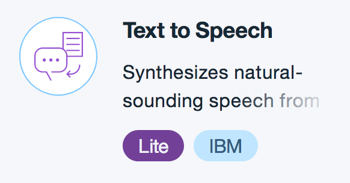
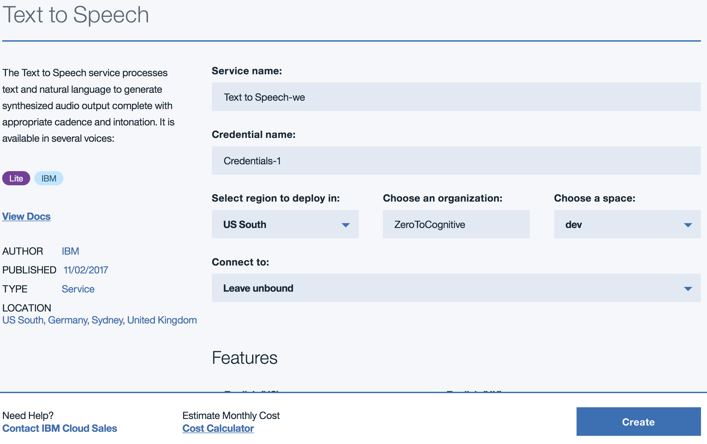

# Chapter 4: Getting Watson to talk back

[Return to Table of Contents](../README.pdf)

## Process

In this chapter, we will 
 - create our second service in IBM Cloud, Watson Text to Speech
 - copy the credentials from IBM Cloud to our env.json file
 - update our server code so that we can synthesize the written word into sound
 - update our html file so that we have a place to put the words we want Watson to say
 - update our browser javascript file to read that text and tell watson to talk to us. 
 - Our app will look like this when we're done: 
 

 ## Create a new service in IBM Cloud (formerly IBM Bluemix)
 
 After you , click on the 'hamburger' menu on the top left part of your web page. It's the icon that looks like 3 horizontal lines. 
 
 Start by navigating to your Dashboard, which is one of the first options to show up when you click on the hamburger menu. When your dashboard loads, please go to the services section:
 
 You're looking to see if you already have a text to speech service, which will look something like this:
 
 If you already have this service, great! you're ready for the next step, if not, then you need to create one, which you will do by first clicking on the hamburger menu and then selecting Watson. The list is aphabetically sorted, so Watson will be near the end: 
 
 When you click on it, you will be shown your current Watson services, since you don't yet have Text to Speech, click on the Create button
 
 and then select the Text to Speech service from the following list:
 
 Once you have selected the service, you want to create the service:
 

 ## Copy your credentials

 After creating the service, you will need to update two files in your local system. You'll update env.json with your credentials, remembering that username and password are unique for each IBM Cloud service which you access
 ```json
 {
    "speech_to_text": {
      "version": "v1",
      "url": "https://stream.watsonplatform.net/speech-to-text/api",
      "password": "stt password",
      "username": "stt user name"
      },

      "text_to_speech": {
          "version": "v1",
          "url": "https://stream.watsonplatform.net/text-to-speech/api",
          "password": "tts password",
          "username": "tts user name"
      }
 }
 ```
and the manifest.yml file with the name of your new service, replacing the -xx in the example below with the correct names of your services. You'll note, below, that the name is more than just Z2C. Names in IBM Cloud must be globally unique in each geographic instance (North America, UK, Europe, Australia) and over 10,000 people have started this tutorial. So I recommend that you use some portion of your email address (without the '@' symbol) as part of your application name:
```yml
Applications:
- path: .
  memory: 128M
  instances: 1
  domain: mybluemix.net
  name: Z2C-youremailshortname-Chapter04
  host: Z2C-youremailshortname-Chapter04
  disk_quota: 1024M
  services:
    - Speech to Text-xx
    - Text to Speech-xx
```
**Congratulations! You've created your second IBM Cloud and Watson service!**

## NodeJS Server code

In the previous chapter, we created a token for the Speech to Text service to work. In this chapter, we need to synthesize the text to turn it into the right sounds. Watson understands many languages, so you can write in multiple languages and Watson will correctly read back what you have said. 

The server code is enhanced with the following new routine:
```javascript
exports.tts_synthesize = function(req, res) {
  console.log("tts_synthesize entered");
  // use the environment variables to configure text to speech
    var ttsConfig = watson.text_to_speech(config.text_to_speech);
    // give the synthesizer the data from the browser.
    // you may find that you get errors if you send in an empty text string. 
    // this can be avoided by testing req.query to see if it has any text in it
    // that would be a good exercise to extend this code
    var transcript = ttsConfig.synthesize(req.query);
    transcript.on('response', function(response) {
      if (req.query.download) {
        response.headers['content-disposition'] = 'attachment; filename=transcript.ogg';
      }
    });
    // if there's an error, log it to the server console window.
    transcript.on('error', function(error) { console.log("error encountered: "+error); next(error); });
    // pipe sends the sound as a stream (vs a downloaded file) back to the browser
    transcript.pipe(res);
}
```
## Browser HTML
Now that the server has been updated, we need to do the same thing for the browser app. We need to add HTML to support an input field and to support a new 'talk' button. The core of our HTML contains the following lines:
```HTML
             <div class="app_container" id="body">
                 <div class="row">
                     <div class="col-md-6 text-center" style="color: #008571; ">
                         <h1>Chapter 4: Getting Watson to talk back</h1>
                     </div>
                   </div>
                   <div class="row">
                     <br/>
                     <div class="col-md-6"><center> ... </center></div>
                     <br/>
                 </div>
                 <div class="row">
                     <div class="col-md-6">
                       <center><div cols="50" class="speech-only" id="speech" readonly wrap="soft" style="height: 5.0em; ">Spoken output goes here</div></center>
                     </div>
                   </div>
                   <div class="row">
                     <br/>
                      <div class="col-md-6"><center><textarea class="text-only" id="chat" rows="5" cols="50" ></textarea></center></div>
                   </div>
                   <div class="row">
                       <div class="col-md-6"><center><a id="readText" class="btn btn-primary" style="padding-left: 0.3em">Watson, Read this.</a></center></div>
                   </div>
                   <div class="row">
                     <div class="col-lg-12 col-md-12 col-sm-12">
                       <div class="audioParent">
                         <audio class="audio" id="a_player">Your browser does not support the audio element.</audio>
                       </div>
                     </div>
                   </div>
                 </div>
```
The first half is unchanged, below the line reading: ```<div cols="50" class="speech-only" id="speech" readonly wrap="soft" style="height: 5.0em; ">Spoken output goes here</div>``` we have added three elements:
- a TEXTAREA called 'chat' 
- a button called 'readText'
- an audio element called 'a_player'

## Browser javascript
Let's look at how we use and interact with the elements. The basic idea is that we will type into the text area, click the button, and listen (via the audio player) to Watson speaking what we wrote. We update the initPage() function with the following code:
```javascript
  // do something useful when the readText button is clicked.
  readText.on("click",  function()
  {
    console.log("initiating text-to-speech service...");
    // if we're going to have Watson talk, we probably don't want it listening at 
    // the same time, so go through the normal 'turn off the microphone' process. 
    // this is missing an if statement, which would make the code more robust.
    // can you figure out what's missing?
    //
    if (!((typeof(stream) == "undefined") || (stream == null))) {stream.stop(); }
    _mic.addClass("mic_enabled");
    _mic.removeClass("mic_disabled");
    _stop.addClass("mic_disabled");
    _stop.removeClass("mic_enabled");

    var sessionPermissions = JSON.parse(localStorage.getItem('sessionPermissions')) ? 0 : 1;
    // get the text to be turned into an audio signal
    var textString = $("#chat").val();
    // select the voice to use (this is assuming US English as the language.)
    // change the en-US_AllisonVoice to a different language if desired.
    var voice = 'en-US_AllisonVoice';
    // get the audio element from the HTML 5 audio player
    var audio = $("#a_player").get(0);
    // build the url to call to synthesize the text
    var synthesizeURL = '/api/text-to-speech/synthesize' +
      '?voice=' + voice +
      '&text=' + encodeURIComponent(textString) +
      '&X-WDC-PL-OPT-OUT=' +  sessionPermissions;
    // attach the synthesize URL to the audio player  
    audio.src = synthesizeURL
    // and pause it in case it's currently running
    audio.pause();
    // add an event listener and the function to call when the voice comes back
    audio.addEventListener('canplaythrough', onCanplaythrough);
    // mute the audio player
    audio.muted = true;
    // set the audio element to play mode, to prepare it for the returning signal
    audio.play();
    // change the cursor so that there's a visual cue that we're now waiting on the server 
    // to send an audio signal back
    $('body').css('cursor', 'wait');
    $('.readText').css('cursor', 'wait');
    return true;
  });
```
and then we add the new 'onCanPlayThrough() function
```javascript
/**
 * This function is called each time an audio signal comes back from the server
 */
function onCanplaythrough() {
  console.log('onCanplaythrough');
  // get the audio player (we could save a step if we passed that in as a parameter from the preceding function)
  var audio = $('#a_player').get(0);
  // remove the event listener. 
  // Why are we doing this? 
  // Each time the readText button is clicked, we add an event listener. But we only want one,
  // so once the event listener process kicks off, we remove the current listener. 
  // this lightens the load on the browser and makes the application more robust
  audio.removeEventListener('canplaythrough', onCanplaythrough);
  // some versions of FireFox have an undetermined bug which causes the audio player to
  // fail if the following try/catch block is missing
  try { audio.currentTime = 0; }
  catch(ex) { // ignore. Firefox just freaks out here for no apparent reason.
            }
  // display the audio controls
  audio.controls = true;
  // unmute the player
  audio.muted = false;
  // animate the audio player, so that there is a visual cue on where we are in the 
  // current playback
  $('html, body').animate({scrollTop: $('#a_player').offset().top}, 500);
  // reset the cursor to whatever the user has specified as their default browser cursor. 
  $('body').css('cursor', 'default');
}
```