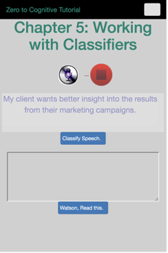
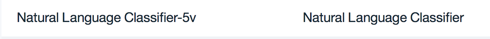
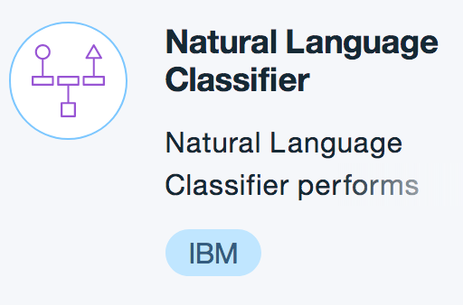
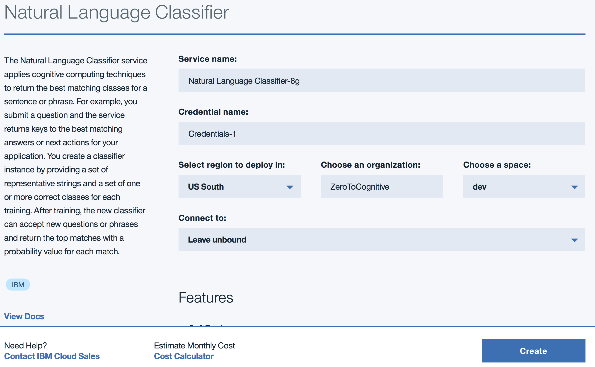

# Chapter 05 Working with Natural Language Classifiers

[Return to Table of Contents](../README.pdf)

In this chapter, we will create a new IBM Cloud service which will allow us to create a custom classifier, create a classifier and then use it from our growing web application. Classfiers will require more work on our part than our previous chapters and we will start using a new service, called CURL, from our workstations. CURL stands for Command line URL, and is a tool which allows us to send get and post commands directly from our command line to other programs. We will use CURL to create, delete and check the status of our classifiers. 

When we're done, we will have created an application with these two web views: 



## Process

- create a new IBM Cloud Service: 
- create a classifier in that service using CURL commands
- copy our credentials into env.json
- Create a new NodeJS Classifier service
- add to our HTML and create a new visual concept
- update our CSS file to support this new concept
- create a new browser javascript file to request classification and display the results. 

## Create a new IBM Cloud Service
After you , click on the 'hamburger' menu on the top left part of your web page. It's the icon that looks like 3 horizontal lines. 
 
 Start by navigating to your Dashboard, which is one of the first options to show up when you click on the hamburger menu. When your dashboard loads, please go to the services section:
 
 You're looking to see if you already have a natural language clasification service, which will look something like this:
 
 If you already have this service, great! you're ready for the next step, if not, then you need to create one, which you will do by first clicking on the hamburger menu and then selecting Watson. The list is aphabetically sorted, so Watson will be near the end: 
 
 When you click on it, you will be shown your current Watson services, since you don't yet have Natural Language Classifier, click on the Create button
 
 and then select the Natural Language Classifier service from the following list:
 
 Once you have selected the service, you want to create the service:
 
## copy your credentials into env.json

Most of the credentials we will copy into the env.json file will come from the credentials for Watson NLC in IBM Cloud. One of the credentials, however, is the classifierID. This is created through the use of the CURL commands from the preceding section and that id needs to be copied into env.json as well. If you forgot to do that, no worries, we can always retrieve it using the following command: 
``` ```
This returns a list of your classifiers. If you have more than one, you'll need to remember which one is the one for this chapter. :)
```JSON
"watson_nlc": {
         "version": "v1",
         "url": "https://gateway.watsonplatform.net/natural-language-classifier/api",
         "password": "<watson nld password>",
         "username": "<watson nlc username>",
         "classifierID": "<watson nlc classifier id from CURL commands>",
          "localJSON": true
     }
```

## Create a new NodeJS Classifier service

### Requesting classification
```javascript
/**
 * This takes the provided text and delivers it to the classifier you've previously built 
 * using your curl commands 
 * @param {NodeJS Request Object} req - provides information about the inbound request
 * This is accessed via a post request rather than a get request. A post request normally
 * has options (data) associated with it and these come in to nodejs as part of the 
 * req.body object.
 * req.body.cquery - inbound text to be classified
 * @param {NodeJS Response Object} res - this is how we respond back to the browser
 */
exports.classifyInd = function(req, res) {
  console.log("Classifier entered");
    _text = req.body.cquery;
    i_output = {};
    // this async request takes some time to process and we want to ensure that the
    // res(sponse) object is still available to us when the process completes.
    // in this example, we're using an anonymous function to accomplish that objective
    (function(_res) {
        natural_language_classifier.classify({
                text: _text,
                classifier_id: classifier_id_industry
            },
            function(err, response) {
                // set up the response object as a successful http action (that's the 200)
                _res.writeHead(200, { "Content-Type": "text/plain" });
                // and then send back whatever response came back. 
                // the nlc_res routine figures this out.
                _res.end(nlc_res("Industry", err, response));
            });
    })(res)
}
```
### formatting the results to send back to the browser

```javascript
/**
 * This formats the response from the classification process into a JSON object 
 * @param {String} classifier - The type of classification just completed. This is included
 * so that one server request can do multiple classifications simultaneously and send back
 * a JSON object with each of the classification responses separated and easily accessed.
 * It's overkill for this chapter, but a useful technique in more complex environments.
 * @param {ERROR} err - an error object or null if no error
 * @param {JSON} respone - the JSON object response from the classifier. Undefined if an 
 * error occurs
 * @return {STRING} result - a stringify'd version of the _output object.
 */
function nlc_res(classifier, err, response) {
    // define the output array
    var _output = [];
    if (err) {
        // ok, we have an error. Print it to the server console
        console.log(classifier + ' error:', err);
        // format the response JSON object
        _output = { 'error': JSON.stringify(err, null, 2) };
    } else {
        // everything is good. Format the results to send back to the calling routine
        _output = { results: JSON.stringify(response, null, 2) };
    }
    console.log("Printing from nlc_res");
    console.log(_output);
    // send the stringifiyed version of _output back to the caller
    return (JSON.stringify(_output, null, 2));
}
```

## Create a 'modal' dialog to display the classification results

Creating the modal dialog is done through several coordinated actions. The first is an update to the index.html file, where a ```<div>``` called ***modal*** is added, between ***top*** and ***body***, which means that it is a 'peer' to body. 
```HTML
             <div class="container", id="top" >
             <div id="modal"></div>
             <div class="app_container" id="body">
```
We then create a new file with just enough HTML to display the classification results. This file is generally referred to as an ***HTML fragment*** because it is not a complete file and depends on lots of work being done for it by it's parent. In our case, the parent file is ```index.html```. This is the ***displayNLC.html*** file:
```HTML
<!-- display NLC Modal Window -->
<div id="modal_NLC" class="modalDialog">
	<div>
		<h2>Classified Text</h2>
		<div class="row">
			<div class="col-lg-12">
				<table class="table" id="industryResult">
					<thead> <tr> <th>Industry</th> <th>Confidence</th></tr> </thead>
					<tbody><tr></tr> </tbody></table>
			</div>
		</div>
		<div class="row">
			<center>
				<button type="button" id="close_NLC" class="btn btn-default" data-dismiss="modal">Close</button>
			</center>
		</div>
	</div>
</div>
```
What makes this work is not the use of the word 'modal' in the id or class names, but what we do in the pageStyles.css file and in our javascript file. 

## Create the CSS to support the modal dialog

You've already used CSS to make some simple changes to your applications look. That's what CSS was designed to do. In the listing below, you'll see modalDialog twice, the second listing includes ```> div```. That means that if you have a modalDialog class, then do something special to the first div inside that you encounter. That would be the 2nd line in the previous listing. 

Things to note below:
 - modalDialog 
    - ```background: rgba(0,0,0,.8); color: #0F0F0F;``` black background, slightly transparent
    - ```z-index:9999;``` move this to the very front of all browser windows
   (and put the next div you find in front of that)
 - modalDialg > div
    - ```width: 400px; position: relative; margin: 10% auto;``` only use part of the screen, take 10% of it and use that as a top and left margin
    - ```border-radius: 10px;``` round the corners
    - ```background: #fff;``` give this new, smaller window a white background
```CSS
.modalDialog {
	position: fixed;
	font-family: Arial, Helvetica, sans-serif;
	top: 0; right: 0; bottom: 0; left: 0;
	background: rgba(0,0,0,.8); color: #0F0F0F;
	z-index: 99999;
	opacity:1;
	-webkit-transition: opacity 400ms ease-in;
	-moz-transition: opacity 400ms ease-in;
	transition: opacity 400ms ease-in;
}

.modalDialog > div {
	width: 400px; position: relative; margin: 10% auto;
	padding: 5px 20px 13px 20px;
	border-radius: 10px;
	background: #fff;
	background: -moz-linear-gradient(#fff, #999);
	background: -webkit-linear-gradient(#fff, #999);
	background: -o-linear-gradient(#fff, #999);
}
```

## Create the javascript for classification

### update z2c-speech.js

Add code to support the new classification function

```javascript
  // do something useful when the displayNLC button is clicked
    displayNLC.on("click",  function()
    {
      // specify the html page to load for the classification results
      var nlcPage = "displayNLC.html";
      // execute the checkNLC function in the Z2C-NLC.js file, sending it
      // the page to load and the html element with the output from the 
      // speech to text process
      checkNLC(nlcPage, stt_out);
    });
```
### create a new z2c-NLC.js file

Get the text from the browser and request classification
```javascript
/**
 * This takes the typed in text, sends it to the classifier and then displays the results 
 * @param {String} _display - what page to load to display the results
 * @param {jQuery} _source - a jQuery pointer to the html element with the text to be analyzed
 */
function checkNLC(_display, _source)
{
  // create an empty options object to hold information to send in the post command
  var options = {};
  // get the text from the browser and put it into the options object
  options.cquery = _source[0].innerHTML;
  // get the display page and post the classification request
  $.when($.get(_display), $.post('/api/understand/classifyInd', options)).done(function(_page, _nlc_results){
    console.log("page returned");
    // modal is new in this chapter and allows us to create a partially transparent overlay
    // window to highlight the classification results and prevent other actions until the 
    // classification results page is cleared.
    // 'modal' is a window management term which indicates that other actions are 
    // unavailable while this window, or dialog, is displayed. Calling the target 'modal'
    // does not make this happen, it is actually a result of the CSS associated with this page
    var _target= $("#modal");
    // display the retrieved HTML page
    _target.append(_page);
    // make the height of the 'modal' page the same height as the browser viewable area
    _target.height($(window).height());
    // and then display it. This makes the black, partially transparent page appear.
    _target.show();
    _data = _nlc_results[0];
    // why two JSON.parse commands? Well, somewhere on the server side we stringified twice
    // probably not a good idea
    _classes = JSON.parse(JSON.parse(_data).results).classes;
    // now that the html page we created for viewing the results has been displayed, we
    // can access the html elements on that page
    // so call the displayNCL routine with the target and the returned classes.
    displayNLC($("#industryResult"), _classes);
    // activate the close button
    closeNLC=$("#close_NLC");
    // clear the modal window when the close button is clicked
    closeNLC.on("click", function(){
      console.log("closeNLC clicked.")
      $("#modal").empty();
    });
});
}
```
Then format the classification results
```javascript
/**
 * format the classes to display in the provided html element
 * @param {String} _target - Jquery object pointing to the html target element
 * @param {Array} _results - the array of results returned by the classifier
 */
function displayNLC(_target, _results)
{
  var target = _target;
  // empty all rows from the target (which is an html table) EXCEPT for the first row
  // which is normally a header row that provides titles to all the colums in the table
  target.find("tr:not(:first)").remove();
  // get the classification schema name (which we created in this object on the server)
  indName = _results[0]["class_name"];
  var len = _results.length;
  _idx = 0;
  while (_idx < len)
  {
    // use an anonymous function to populate all the rows in the table. 
    (function(_idx, data)
      {  _cStr = data[_idx]["class_name"];
        target.append("<tr><td style='width: 60%'>"+_cStr +"</td><td>"+data[_idx]["confidence"]+"</td></tr>");})
      (_idx, _results)
    _idx++;
  }
  // close the table.
  target.append("</table>");
}
```