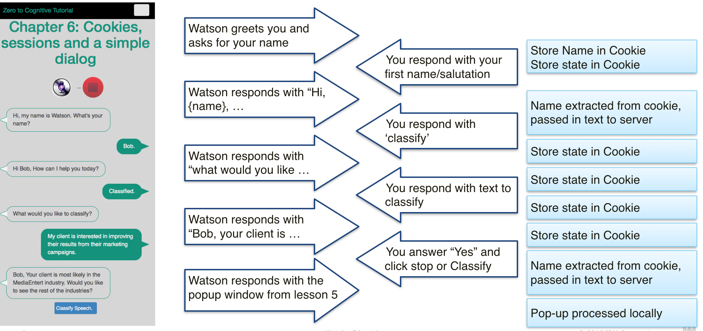
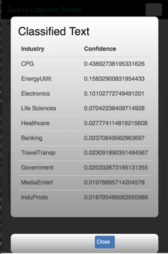

# Chapter 06 Creating a custom Dialog

[Return to Table of Contents](../README.pdf)

In this chapter, we will use the services we've already created to build an interactive application. We're going to build a custom dialog, just using javascript. Why? Because we may be asked to do this and it's really helpful to understand what's involved in even creating a very simple dialog. Later, in Chapter 10, we will use Watson's Conversation service to create a much more sophisticated dialog with little more work that this chapter will require. 

In this app, we will talk to Watson and Watson, guided by a single JSON object, will respond to us and, when we're done, to classify a statement. The application will operate and look like this: 

You'll notice that the view has changed. We're now displaying text bubbles on the left and right, with different foreground and background colors, to signify Watson (left side) and us (right side). After we tell Watson that we want to "classify" something, we're asked for the text to classify. Watson then responds with an answer (this is the highest probability industry) and a question (do you want to see all results. If we want to see the full results from the classification, we will reuse the code from Chapter 5 to display the following image:


## Process

 All of the changes that we will make are on the browser side. No updates are required on the server side and we do not need to create any new IBM Cloud services. 
- Update the CSS to support text bubbles
- update z2c-speech.js
- update z2c-NLC.js
- create z2c-dialog.js
- update z2c-utilities.js

### update CSS

There are two bubble shapes used in this app, bubble1 and bubble2. Aside from the fact that one is on the left and the other on the right, they are nearly identical. Let's look at bubble1, which is on the right. Things to note: 

#### bubble1 {

 - ```float: right;``` this, not surprisingly, causes this bubble to move to the right side of it's containing div
 - ```border-radius: 3px;```round the corners of the bubble
 - ```border: 1px solid #008571;``` create a solid border and give it a color (this can be any color you choose)
 - ```background-color: #008571;``` give the bubble background a specific color

 #### bubble1 p {
 - ```font-size: 1.15em;``` make the font a little bigger
 - ```color: #ffffff;``` make the font color white

```CSS
.bubble1 {
    /*background-image: -webkit-linear-gradient(top, #ebfdf9, #A7FAE6);*/
    float: right;
    margin-left: 120px;
    margin-right: 30px;
    border-radius: 3px;
    position: relative;
		border-radius: 20px;
    border: 1px solid #008571;
    background-color: #008571;
    /*box-shadow: 0px 2px 2px rgba(0, 0, 0, 0.15);*/
}

.bubble1 p {
    font-family: helvetica, Arial, sans-serif;
    font-size: 1.15em;
    font-weight: normal;
		border-radius: 10px;
    color: #ffffff;
    padding: 0 1.15em;
    margin: 10px 0;
}
```
### z2c-speech.js: code cleanup

We will start with a little refactoring. You may have noticed that, in the preceding chapters, the number of times we had to code the mic-on -- mic-off sequence was growing. So, let's get rid of the duplicate code. We now have a single function which accepts to html tags and a boolean. 
```javascript
/**
 * This is a refactoring of the logic from previous chapters which toggled the state
 * of the microphone and stop icons. 
 * @param {jQuery object} _microphone - Jquery object pointing to the microphone html element
 * @param {jQuery object} _stopbutton - Jquery object pointing to the stop html element
 * @param {boolean} b_on - boolean flag identifying if this is to enable the stop button (true) or the microphone (false)
 */
function toggle_mic(_microphone, _stopbutton, b_on)
{
  if(b_on) // microphone button clicked, enable stop button
  {
    _microphone.addClass("mic_disabled");
    _microphone.removeClass("mic_enabled");
    _stopbutton.addClass("mic_enabled");
    _stopbutton.removeClass("mic_disabled");
  } else // stop button clicked, enable microphone button
  {
    if (!((typeof(stream) == "undefined") || (stream == null))) {stream.stop(); }
    _microphone.addClass("mic_enabled");
    _microphone.removeClass("mic_disabled");
    _stopbutton.addClass("mic_disabled");
    _stopbutton.removeClass("mic_enabled");
  }
}
```
### z2c-speech.js: creating a 'listen' function

There are many places in the application where we want Watson to do a speech to text translation, and we need Watson to place that information in the correct and ever-changing text bubble. The text bubble it will use to display text is the inbound parameter (_target)

```javascript
/**
 * create a function to handle speech to text in general
 * pass in the name of the HTML object which will display the received text. 
 * This function has been refactored so that the get token function is called only once, rather
 * than every time the microphone has been activated.
 * @param {jQuery object} _target - Jquery object pointing to the speech to text output html element
 */
function listen(_target)
{
  // b_token is a boolean (e.g. only true or false) flag that tells us if we have previously retrieved a token 
  if (!b_token)
  {
    // get the token
    $.when($.get('/api/speech-to-text/token')).done(
      function (token) {
        // save the token returned by the server
        document.cookie = "stt-token="+token;
        // set the boolean flag to indicate that we have both retrieved AND saved the token
        b_token = true
        // set up the stream from the microphone to Watson
        stream = WatsonSpeech.SpeechToText.recognizeMicrophone({
           token: token,
           outputElement: _target // CSS selector or DOM Element
         });
         // if there is an error, display it on the browser console.
        stream.on('error', function(err) { console.log(err); });
      });
  }else
  {
      // set up the stream from the microphone to Watson
      stream = WatsonSpeech.SpeechToText.recognizeMicrophone({
        // retrieve the previously saved token
      token: getCookieValue("stt-token"),
      outputElement: _target // CSS selector or DOM Element
    });
    // if there is an error, display it on the browser console.
   stream.on('error', function(err) { console.log(err); });

  }
}
```

## z2c-speech.js: Creating a 'talk' function

Just as we had to create a listen function that would work with a changing target location, we also need to have a common talk function which will display the text it is 'reading' to a changing location. This uses the same, single, a_player html object and the same, single onCanPlayThrough() function from our previous chapters. 
```javascript
// create a function to handle text to speech in general
// pass in the text string to be read, the audio player to use and if the audio player should be displayed.
function speak (_chat, _a_player_target, b_display)
{
  var sessionPermissions = JSON.parse(localStorage.getItem('sessionPermissions')) ? 0 : 1;
  var textString = _chat;
  var voice = 'en-US_AllisonVoice';
  var audioFrame = $(_a_player_target);
  var audio = audioFrame.get(0);
  var synthesizeURL = '/api/text-to-speech/synthesize' +
    '?voice=' + voice +
    '&text=' + encodeURIComponent(textString) +
    '&X-WDC-PL-OPT-OUT=' +  sessionPermissions;
  audio.src = synthesizeURL
  audio.pause();
  audio.addEventListener('canplaythrough', onCanplaythrough);
  audio.muted = true;
  audio.play();
  (b_display) ? audioFrame.show() : audioFrame.hide();
}
```

### z2c-NLC.js: get the top industry

We rewrite the get classification function in the z2c-NLC file so that the initial response is to read out the highest probability industry, as shown below:
```javascript
/**
 * This is a rewrite of the checkNLC function from the previous chapter to integrated the 
 * checking process into the custom dialog for this chapter and to save the classification results
 * for later display, should the user choose that option
 * @param {String} _target - Jquery object pointing to the html target element
 * @param {Array} _results - the array of results returned by the classifier
 */
function getIndustryClassification(_source, _string)
{
  var options = {};
  options.cquery = _source[0].innerText;
  $.when( $.post('/api/understand/classifyInd', options)).done(function(_nlc_results){
    _data = _nlc_results;
    nlc_classes = JSON.parse(JSON.parse(_data).results).classes;
    industry = nlc_classes[0].class_name;
    toggle_mic(_mic, _stop, false)
    talkToMe(dialog_target, _string.format(getCookieValue("name"), industry));
  });
}
```
This uses a ```talkToMe``` function, but we've not seen that yet. It's in the new z2c-dialog.js file. Let's look at that next. 

### z2c-dialog.js: Creating the dialog

The first thing we do is to create a dialog object which we can traverse using javascript and maintain separate from most of the code. The JSON object which manages our dialog is: 
```javascript
// To build a custom dialog, we need to understand where we are, what we're supposed to do and, if it's predictable, where we go next.
// the customDialog object uses the first value (['initialize'], or ['start'], or ['name'], etc)
// to name the current step. Each step, along with this name, has a JSON object with either 2 0r 3 parameters.
// if the JSON 'type' value is 'talk', then we need to know what to say. In this situation, we have the 3rd parameter: message
// otherwise we only have the 'type' and 'next' parameters. 'next' tells us the name of the next step
var customDialog = {};
customDialog['initialize'] = {type: 'talk', next: 'start', message: "Hi, my name is Watson. What's your name?"};
customDialog['start'] = {type: 'listen', next: 'name'};
customDialog['name'] = {type: 'talk', next: 'actionAsk', message: "Hi {0}, how can I help you today?"};
customDialog['actionAsk'] = {type: 'listen', next: 'actionSelect'};
customDialog['actionSelect'] = {type: 'talk', next: 'getClassificationText', message: "What would you like to classify?"};
customDialog['getClassificationText'] = {type: 'listen', next: 'classify'};
customDialog['classify'] = {type: 'talk', next: 'classifyAsk', message: "{0}, Your client is most likely in the {1} industry. Would you like to see probabilities for the top 10 industries?"};
customDialog['classifyAsk'] = {type: 'listen', next: 'classifyDetails'};
customDialog['classifyDetails'] = {type: 'process', next: 'name'};
```
To use this dialog effectively, we have to be able to take 4 distinct actions:

 - initialize the dialog
 - talk
 - listen
 - figure out the next step and do it

### z2c-dialog.js: initialization

This one is fairly simple, we need to point to the beginning of the customDialog JSON object, remember where we're putting information and then tell the next step process to activate, based on whether we already know your name, or still need to learn it. 
```javascript
/**
 * startup the dialog
 * @param {String} _target - the name of the html element where text is to be displayed
 */
function startDialog(_target)
{
  // set the prevstep cookie to the start of the dialog
  document.cookie = "prevstep=startDialog";
  // hide the nlc button as we're not yet ready for it
  NLC_Button.hide();
  // create a jQuery object from the passed in string
  dialog_target = $(_target);
  // remove all content from that html element
  dialog_target.empty();
  // if we don't yet know with whom we're speaking, set the dialog to the name step
  if (getCookieValue("name") != "") {document.cookie = "step=name"; nextStep();}
  // otherwise set it to the start step
  else { document.cookie = "step=start"; talkToMe(dialog_target, customDialog['initialize'].message); }
}

```
### z2c-dialog.js: talk

Talk is passed a string, which is the text to be verbalized, and a target, which is where the text is to be displayed on the web page. The text is displayed and, simultaneously, sent to the speak function in z2c-speech.js
```javascript
/**
 * talk to me ... use the existing text to speech service to talk to the user
 * @param {String} _target - html element to display the provided text
 * @param {String} _string - the text to display
 */
function talkToMe (_target, _string)
{
  // display the provided text
  _target.append('<div class="shape bubble2"><p>'+_string+'</p></div>');
  // call the speech to text function to have Watson talk to you, using the provided string
  speak(_string, a_player_target, false);
}
```
### z2c-dialog.js: listen

This uses the refactored listen function in z2c-speech.js and creates a text bubble on the page to hold the text coming back from Watson. Because we want to make sure that the text appears in the correct place, we concatenate the word chat with the name of the step to create an id for the HTML element that holds each text bubble. This ensures uniquness and leverages our dialog design.
```javascript
/**
 * create the visual space for the text bubble
 * @param {String} _step - name of the step we're on
 */
function listenToMe(_step)
{
  // html id's should be unique per web page. If they are not unique, browser behavior is officially undefined.
  // this will make the chat id's unique
    var chat = "chat_"+_step;
    // create a div in the dialog_target (global variable) to hold the output from Watson Speech to Text
    dialog_target.append('<div class="shape bubble1"><p id="'+chat+'">...</p></div>');
    // point the stt_out variable to this newly created <div>
    stt_out = $("#"+chat);
    // tell Watson to start listening
    listen("#"+chat);
}
```
### z2c-dialog.js: figure out the next step

The strength of the dialog JSON object is that it is a very compact way to represent the dialog we will support. To be effective, it needs some partner code to bring it to life. That's what this function does. This uses switch/case logic to determine what to do in each step in the dialog and then uses the dialog object itself to determine the next step. 
```javascript
/**
 * figure out the next step in the conversation. This function uses the JSON custom_dialog object we 
 * created at the top of this file
 */
function nextStep()
{
  // pring a tracking message to the web console showing the previous step and this step
  // the prevstep and step cookie values are set as part of this function, via a call to incrementStep
  console.log("previous step was: "+getCookieValue("prevstep")+" and this step is: "+getCookieValue("step"));
  var step = getCookieValue("step");

  // here we will go through the various steps to determine what to do. 
  // switch/case works by evaluating a constant term (step) against a variety of options (case 'some value':)
  // a case is entered when the value next to the case statement equals the value provided in the switch statement
  // a case is exited when the break; command is encountered. 
  // this means that multiple case statements which require identical processing can be stacked together with a common
  // set of steps and a single break statement. You will see that approach at the very beginning of the following code.
  switch (step) {
    case 'getClassificationText': // classification requested. enable button, listen
      NLC_Button.show();
    case 'start':  // start of a dialog, don't have person's name
    case 'actionAsk': // request classification
    case 'classifyAsk': // would you like to see the rest of the results?
      listenToMe(getCookieValue("step"));
      incrementStep(customDialog[step].next);
      break;

    case 'name': // have person's name, need to remember it
      // because we're going to allow this program to loop, check to see if we need to clear the dialog and hide the classify button
      if(!isFirst) {NLC_Button.hide(); dialog_target.empty();}
      else {
        // get Name and save it as a cookie
        if (getCookieValue("name") == "")
        { document.cookie = "name="+trimStrip($("#chat_"+getCookieValue("prevstep"))[0].innerText); }
        isFirst=false;
        }
      talkToMe(dialog_target, customDialog[step].message.format(getCookieValue("name")));
      incrementStep(customDialog[step].next);
      break;

    case 'actionSelect': // check if classification requested. if not, return to "how can I help you"
      // check to see if text == classify or classified
      // if so, set up for classification, else reset steo and call nextStep().
      var str = trimStrip($("#chat_"+getCookieValue("prevstep"))[0].innerText).toLowerCase();
      if((str=="classify") || (str=="classified") || (str=="classifier"))
        { talkToMe(dialog_target, customDialog[step].message);
        incrementStep(customDialog[step].next);
        }
        else {
          incrementStep("name");
          nextStep(); }
      break;

    case 'classify': // stop button clicked after classification requested. initiate classification process.
      msg_out = customDialog[step].message;
      var nlcPage = "displayNLC.html";
      if(this.className == "mic_enabled") {toggle_mic(_mic, _stop, false)}
      getIndustryClassification(stt_out, msg_out);
      NLC_Button.hide();
      incrementStep(customDialog[step].next);
      break;

    case 'classifyDetails': // listen for positive response.
      var str = trimStrip($("#chat_"+getCookieValue("prevstep"))[0].innerText).toLowerCase();
      // look for a variety of positive statements in the language of your choice.
      if((str=="yes") || (str=="yup") || (str=="yeah"))
        {
          incrementStep(customDialog[step].next);
          setModal(industryPage, displayNLC, industryTable, nlc_classes); }
        else {
          incrementStep(customDialog[step].next);
          nextStep(); }
      break;

    default: // step has an unexpected value
    console.log('default entered. step = '+step);
      break;
    }
}
```
